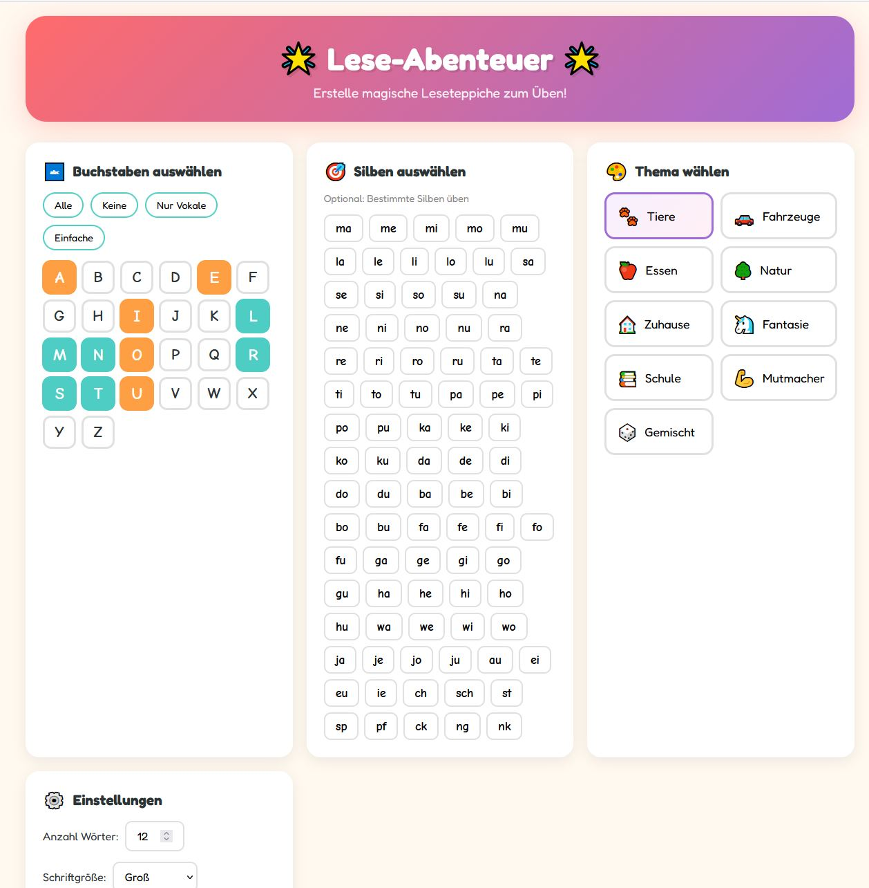
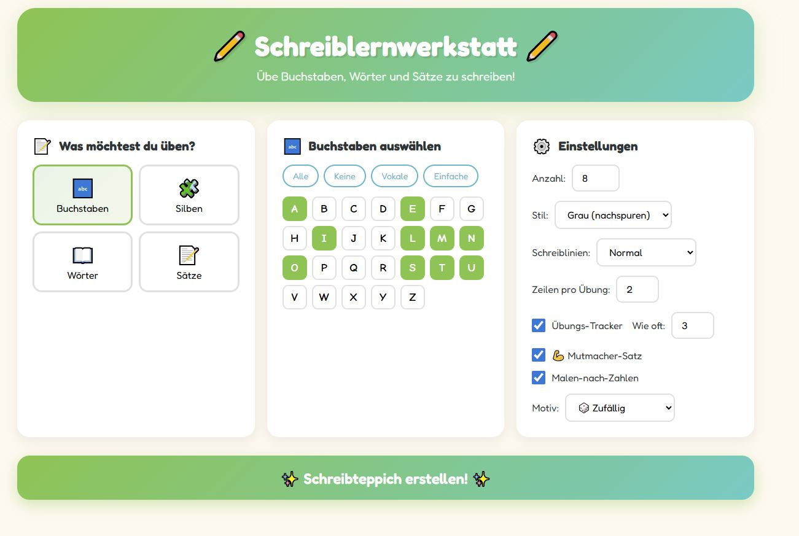
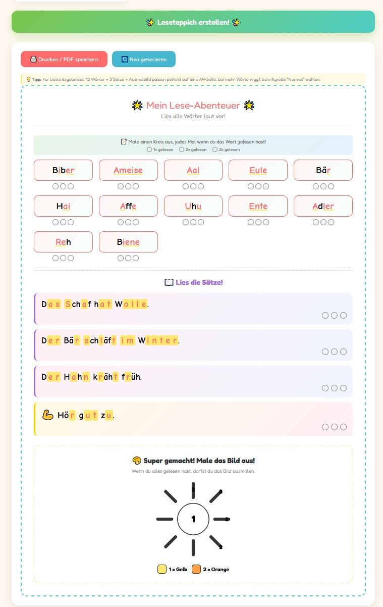
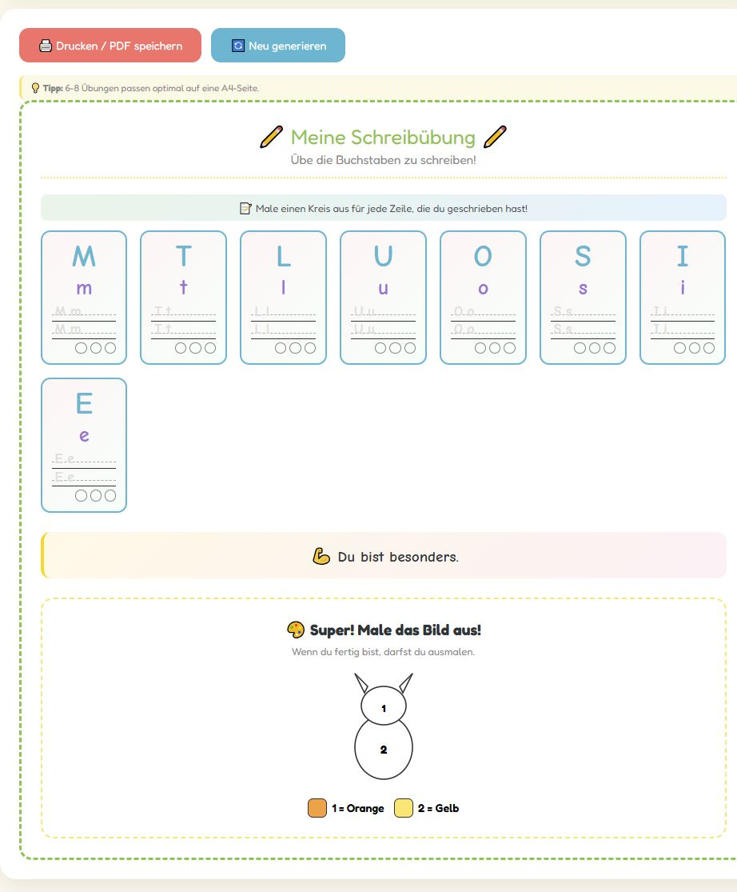
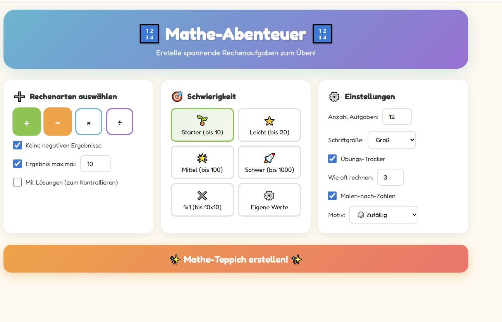
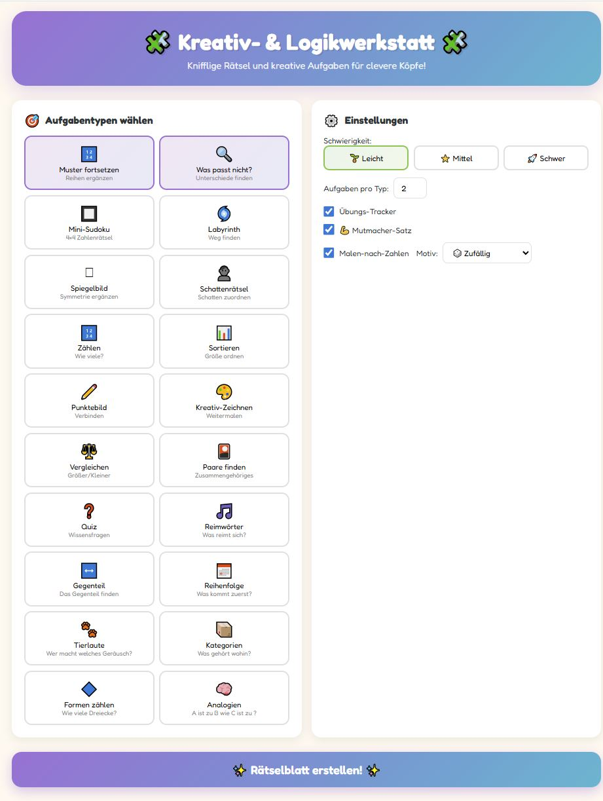
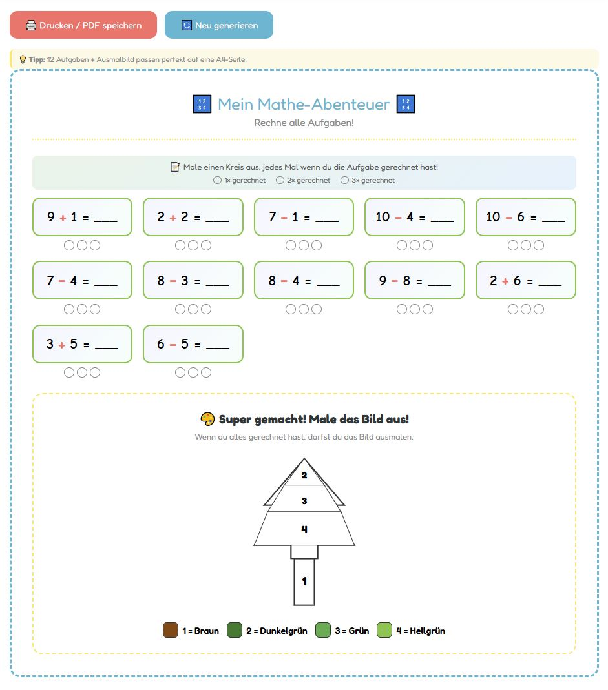
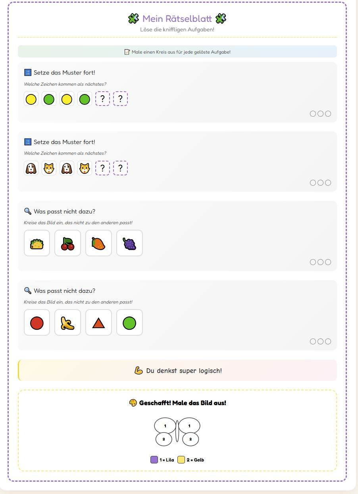

# 🌟 Die Lernwerkstatt: Lese-, Schreib-, Mathe- & Logik-Generatoren

Ein Paket aus vier interaktiven Web-Tools, mit denen Eltern und Lehrkräfte in Sekundenschnelle individuelle Übungsblätter (sogenannte "Teppiche") erstellen können. 

**Der Fokus liegt auf dem händischen Üben:** Die Generatoren sind dafür optimiert, ausgedruckt zu werden. Das manuelle Schreiben und Rechnen auf Papier ist essenziell für die Feinmotorik und den Lernerfolg.

> **Erfolgsbericht:** Durch das regelmäßige Üben mit diesen Blättern konnte meine Tochter ihre Schreib- und Rechenflüssigkeit bereits deutlich verbessern!

---

## 🚀 Live-Generatoren (Direkt im Browser starten)

* 📖 [Lese-Abenteuer](https://Talwar85.github.io/Lernhilfen/leseteppich.html)
* ✏️ [Schreiblernwerkstatt](https://Talwar85.github.io/Lernhilfen/schreibteppich.html)
* 🔢 [Mathe-Abenteuer](https://Talwar85.github.io/Lernhilfen/matheteppich.html)
* 🧩 [Logikwerkstatt](https://Talwar85.github.io/Lernhilfen/logikteppich.html)

---

## 📸 Einblicke in die Übungsblätter

| Lese-Abenteuer | Schreiblernwerkstatt |
| :---: | :---: |
|  |  |
|  |  |

| Mathe-Abenteuer | Logikwerkstatt |
| :---: | :---: |
|  |  |
|  |  |

---

## 🛠 Die Tools im Überblick

### 📖 Lese-Abenteuer (`leseteppich.html`)
Hilft bei der Leseflüssigkeit durch gezielte Auswahl von Buchstaben und Silben. Inklusive Motivations-Ausmalbild.

### ✏️ Schreiblernwerkstatt (`schreibteppich.html`)
Generiert Blätter zum Nachspuren oder Abschreiben. Verschiedene Lineaturen unterstützen Kinder beim Schönschreiben.

### 🔢 Mathe-Abenteuer (`matheteppich.html`)
Erzeugt Aufgaben für alle Grundrechenarten. Ergebnisse können limitiert werden, um Überforderung zu vermeiden.

### 🧩 Logikwerkstatt (`logikteppich.html`)
Bietet knifflige Rätsel wie Sudokus, Labyrinthe und Schattenbilder zur Förderung der Konzentration.

---

## 📖 Anleitung für den Einsatz
1. Eines der Tools oben anklicken oder die HTML-Datei lokal im Browser öffnen.
2. Lerninhalte konfigurieren und auf **"Erstellen"** klicken.
3. **"Drucken / PDF speichern"** wählen.
4. *Wichtig:* In den Druckeinstellungen **"Hintergrundgrafiken" aktivieren**, damit alle Linien und Farben gedruckt werden.

## 📄 Lizenz
Dieses Projekt steht unter der MIT-Lizenz.